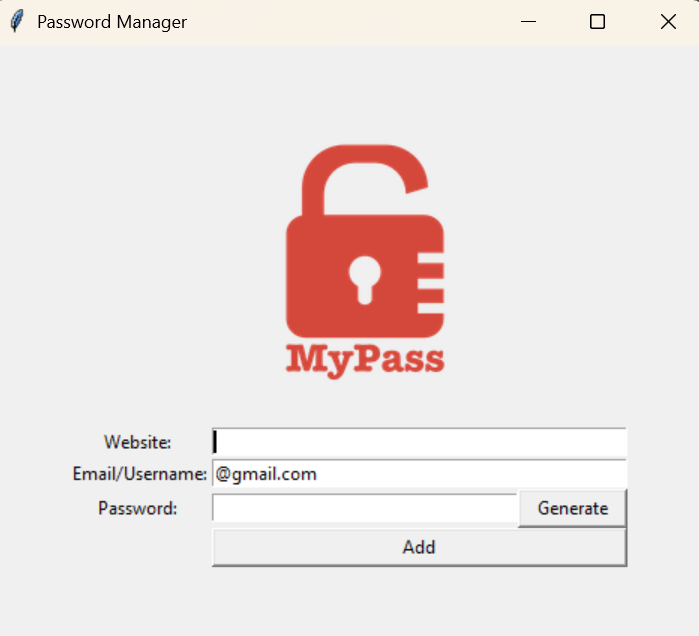

# Password Manager

A simple password manager with a graphical user interface built using Python's 'tkinter' library. This application allows users to store their password ina text file and generate random passwords for new accounts.

## Features

- Store website credentials (website, email/username, password).
- Auto-generates random passwords for new accounts by clicking on the button.
- User-friendly interface for adding new credentials.
- Saves credentials to a local text file for easy access.
- The email text entry is prefilled with "@gmail.com".

## Screenshots

## Installation

1. Clone the repository to your local machine,
2. Navigate to the project directory,
3. Install Python if you don't have it already
4. Ensure the tkinter library is available. It is included by default in python's standard library

## File Structure

* main.py - main script to run the password manager
* data.txt - stores saved credentials in the format:
  Website | Email/Username | Password
* Logo.png - the logo for the application

## Planned features

* Encrypt the data.txt file for enhanced security
* Add search functionality to find stored credentials

## Contributing

Contributions are welcome! Feel free to submit a pull request or open and issue to suggest improvements.
